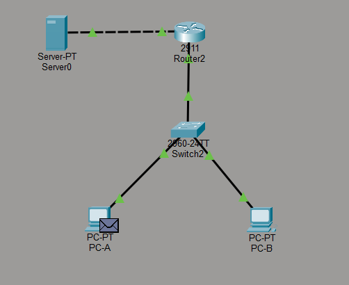

# Small Office Network - Cisco Packet Tracer Lab

##  Objective

Configure a basic network where PC-A can communicate with a Server using a Router.

##  Topology

* 1 Router (2911)
* 1 Switch (2960-24TT)
* 2 PCs (PC-A, PC-B)
* 1 Server

##  Connections

* PC-A → Switch Fa0/1
* PC-B → Switch Fa0/2
* Switch Gi0/1 → Router Gi0/0
* Server → Router Gi0/1

##  IP Addressing Scheme

| Device | Interface | IP Address   | Subnet Mask     | Gateway     |
| ------ | --------- | ------------ | --------------- | ----------- |
| PC-A   | NIC       | 192.168.1.10 | 255.255.255.0   | 192.168.1.1 |
| PC-B   | NIC       | 192.168.1.11 | 255.255.255.0   | 192.168.1.1 |
| Router | Gi0/0     | 192.168.1.1  | 255.255.255.0   | N/A         |
| Router | Gi0/1     | 10.0.0.1     | 255.255.255.252 | N/A         |
| Server | NIC       | 10.0.0.2     | 255.255.255.252 | 10.0.0.1    |

##  Router Configuration

```
enable
configure terminal
interface GigabitEthernet0/0
ip address 192.168.1.1 255.255.255.0
no shutdown

interface GigabitEthernet0/1
ip address 10.0.0.1 255.255.255.252
no shutdown
end
copy running-config startup-config
```

##  Verification

* Ping from PC-A → 10.0.0.2 successful
* First ping may timeout (ARP), next pings succeed

##  Simulation Insight

* MAC address changes at Router (Layer 3)
* IP address remains unchanged

## Topology

